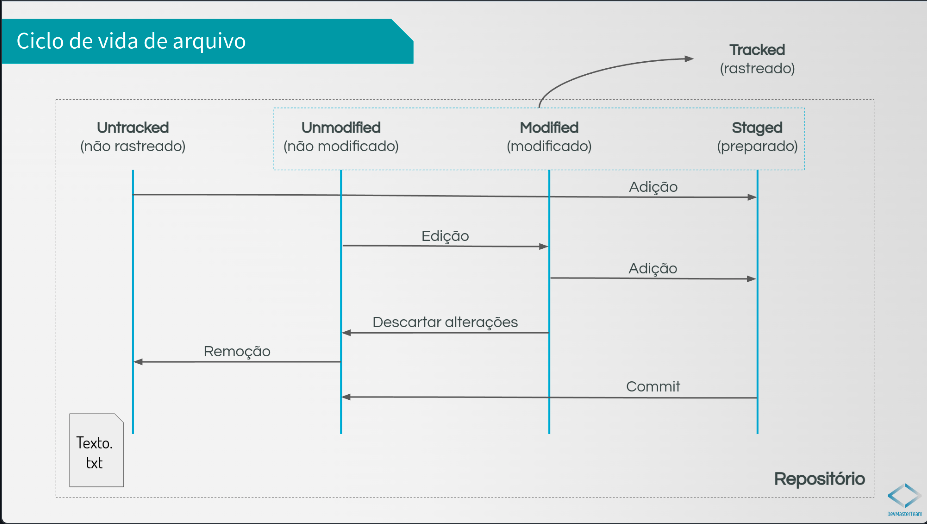

# Comandos Git
## Criar repositório
- Para iniciar uma repositorio no projeto

    ```bash
    git init
    ```

- Para configurar a branch padrão para todos os projeto da maquina

    ```bash
    git config --global init.defaultBranch main
    ```
    > **Nota**: o padrão da branch principal é main 

- Para saber o status do seu repositório

    ```bash
    git status
    ```
- Para ***Deletar*** o Repositório git
    
    ```bash
    rm -fr .git
    ```
    > **Aviso**: Evite deletar a pasta .git
## Adicionar Mudanças
- Para adicionar arquivos ou pastas para o git começar a monitorar suas mudanças
    
    **Arquivos**
    ```bash
    git add arquivo.txt
    ```
    **Pastas**
    ```bash
    git add ./pastas
    ```
    **Tudo**
    ```bash
    git add .
    git add -A
    git add --all
    ```
## Remover Arquivos Adicionados
- Para remover arquivos ou pastas adicionados ao git por engano
    
    **Tudo**
    ```bash
    git rm --cached -r .
    ```
    **Arquivos**
    ```bash
    git rm arquivo.txt
    ```
    **Pastas**
    ```bash
    git rm ./pastas
    ```
## Salvar Mudanças
- Para salvar as mudanças de arquivos ou/e pastas adicionados ao git
    ```bash
    git commit -m "mensagem"
    ```
    > **Nota**: o commit só irá registrar os arquivos que já estão registrados no repositório por isso use o `git add` para registrar novos arquivos e `git status` para ver quais arquivos não estão no repositório
## 4 Estados do arquivo


## Visualizar alterações
- Para exibir todas as diferenças entre seus commits, branch e cópias locais e o índice sincronizado
    
    *Quando o arquivo esta <ins>Modified</ins>*
    ```bash
    git diff
    ```
    *Quando o arquivo esta <ins>Staged</ins>*
    ```bash
    git diff --cached
    git diff --staged
    ```
## Visualizar Histórico dos Commits
- Para listar o que foi feito no repositório através dos commits
    
    ```bash
    git log
    ```
    *Mostrar apenas as mensagens*
    ```bash
    git log --oneline
    ```
    *Mostrar um certo numero de commits*
    ```bash
    git log -2
    ```
    *Mostrar apenas as mensagens e um certo numero de commits*
    ```bash
    git log --oneline -2
    ```
    *Mostrar as atualizações dos commits*
    ```bash
    git log --patch
    git log -p
    ```
    *Mostrar os arquivos modificados dos commits*
    ```bash
    git log --stat
    ```
    *Mostrar os arquivos modificados dos commits de forma curta*
    ```bash
    git log --shortstat
    ```
## Alterar Commits
- Para Alterar a mensagem do commit
    
    ```bash
    git commit --amend -m "Nova mensagem"
    git commit --amend
    ```
- Para Alterar somente o conteúdo do commit
    
    ```bash
    git commit --amend -no-edit
    ```
## Alterar editor de texto
- Para Alterar o editor de texto da mensagem do commit
    
    ```bash
    git config --global core.editor "code --wait"
    ```
## Usar Commit anterior
- Para restabeler um versão salva em um commit do repositorio
    
    ```bash
    git checkout id-commit
    ```
    *Para voltar a ultima commit*
    ```bash
    git checkout nome_da_branch
    git checkout main
    ```
- Para reverter mudanças num arquivo
    ```bash
    git checkout arquivo.txt
    ```
- Para Limpar arquivos não rastreados
    ```bash
    git clean -f
    ```
- Para Limpar arquivos não rastreados e modificados
    ```bash
    git reset --hard
    ```

    
## Ignorar Arquivos

Para ignorar arquivos no repositório quando fizer um `git add .`, devemos criar o arquivo `.gitignore`.
Para entender melhor esse arquivo e modelos dele para diversos projeto acesse [gitignore Github](https://github.com/github/gitignore)

## Parar de rastrear um arquivo
- Para parar de rastrear determinado arquivo do projeto

    ```bash
    git update-index --skip-worktree arquivo.txt
    ```
    *Para voltar a rastrear*
    ```bash
    git update-index --no-skip-worktree arquivo.txt
    ```

## Clonar repositório

- clonar repositório local

    ```bash
    git clone endereco_do_repositório_na_maquina novo_projeto
    ```
- clonar repositório remoto

    ```bash
    git clone url_repositório
    ```
## Criar Branchs

- Listar Branchs

    ```bash
    git branch
    git branch --list
    ```
- Criar branch

    ```bash
    git branch nova_branch
    ```
- Selecionar Branch para desenvolvimento
    ```bash
    git checkout nova_branch
    ```
    *Para selecionar e criar uma nova branch*

    ```bash
    git checkout -b nova_branch
    git switch -c nova_branch
    ```
    *Outra alternativa*
    ```bash
    git switch nova_branch
    ```
    *voltar a ultima branch acessada*
    ```bash
    git switch -
    ```
## Deletar Branchs
- Deletar de forma simples branch local
    ```bash
    git branch -d <outra_branch>
    ```
- Deletar de forma Forçada branch local
    ```bash
    git branch -D <outra_branch>
    ```
- Deletar branch Remota
    ```bash
    git push --delete origin <nome_da_branch_remota>
    ```
## Renomear Branchs
- renomear um branch local
    ```bash
    git branch -m <outra_branch> <novo_nome>
    ```
## Hitórico Branchs
- Para ver o histórico de alterações de uma branch local
    ```bash
    git log <branch> --oneline -5
    ```
## Merge
- Para ***trazer*** as alterações de outra branch na branch em uso:
    ```bash
    git checkout <branch_que_desejo_mesclar>
    git merge <outra_branch>
    ```
- Para saber quais branchs foram mergeadas:
    ```bash
    git branch --merged
    ```
- Para saber quais branchs não foram mergeadas:
    ```bash
    git branch --no-merged
    ```
- Para reverter uma merge em caso de conflito:
    ```bash
    git merge --abort
    ```
## Source Code Management


## Tags
o Git tem a habilidade de marcar pontos específicos na história como sendo importantes. Normalmente as pessoas usam essa funcionalidade para marcar pontos onde foram feitas releases (v1.0 e assim por diante).
- Criar uma tag:
    ```bash
    git tag <nome_da_tag>
    ```
- Criar uma tag anotada com criador e mensagem:
    ```bash
    git tag -a <nome_da_tag> -m <mensagem>
    ```
- Visualizar uma tag:
    ```bash
    git show <nome_da_tag>
    ```
- Listar tags:
    ```bash
    git tag
    git tag -l
    git tag --list
    git tag -n
    ```
- Associar tags a commits antigos:
    ```bash
    git tag <nome_da_tag> <id_commit>
    ```
- Associar tags anotadas a commits antigos:
    ```bash
    git tag -a <nome_da_tag> -m <mensagem> <id_commit>
    ```
- Enviar tags a repositórios remotos:
    ```bash
    git push origin tag <nome_da_tag>
    ```
- Enviar todas as tags para repositórios remotos:
    ```bash
    git push --tag
    ```
- Comparar tags:
    ```bash
    git diff <nome_da_tag> <nome_da_outra_tag>
    ```
- Deletar tags localmente:
    ```bash
    git tags -d <nome_da_tag>
    ```
- Deletar tags remotas:
    ```bash
    git push --delete origin <nome_da_tag>
    ```
## Stash

`git stash` arquiva (ou faz o stash) de alterações que você fez na cópia de trabalho durante um determinado período, para que você possa trabalhar em outra coisa, depois voltar e fazer a reaplicação mais tarde. O stashing é útil quando você precisa alternar com rapidez o contexto e trabalhar em outra coisa, mas está no meio da alteração de código e não está pronto para fazer commit.

- Para arquivar as mudanças:
    ```bash
    git stash
    ```
- Listar as mudanças arquivadas:
    ```bash
    git stash list
    ```
- Aplicar as mudanças arquivadas:
    ```bash
    git stash apply 
    git stash apply <stash_especifico>
    ```
- Remover as mudanças arquivadas:

    *ultimo a ser arquivado na posição 0*
    ```bash
    git stash pop
    ```
    *stash_especifico*
    ```bash
    git stash pop <stash_especifico>
    ```
    *Apagar tudo*
    ```bash
    git stash drop
    ```
- Remover as mudanças arquivadas:

    *ultimo a ser arquivado na posição 0*
    ```bash
    git stash pop
    ```
    *stash_especifico*
    ```bash
    git stash pop <stash_especifico>
    ```
    *Apagar tudo*
    ```bash
    git stash drop
    ```
- Criar novas branchs com as mudanças arquivadas:
    ```bash
    git stash branch <nome_da_branch>
    git stash branch <nome_da_branch> <stash_especifico>
    ```